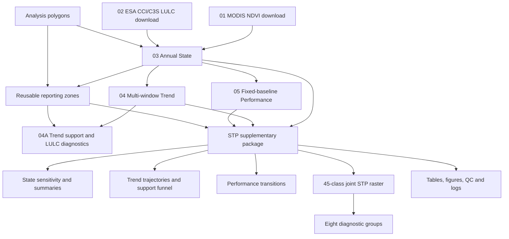

# Reference-led State–Trend–Performance analysis of land productivity

This repository contains the reproducible Python workflow used to construct, evaluate and integrate benchmark-relative **State**, multi-window **Trend** and fixed-baseline **Performance** indicators from annual MODIS NDVI across terrestrial Africa.

The code accompanies the manuscript:

> **Reference-led re-operationalisation of productivity-based State, Trend and Performance beyond harmonised land-degradation reporting**

The numbered scripts reproduce the main processing stages. The `STP_Supplementary_Database` package then aggregates the canonical raster products into reporting-unit summaries, diagnostic tables, figures and joint State–Trend–Performance outputs.

---

## 1. Repository structure

```text
repository-root/
├── README.md
├── Codes/
│   ├── 01_Download_modis_mod13q1_ndvi.py
│   ├── 02_Download_ESA_CCI_LULC.py
│   ├── 03_STATE_Annual.py
│   ├── 04_TREND_Annual.py
│   ├── 04A_TREND_statistical_support_and_LULC_diagnostics.py
│   ├── 05_PERFORMANCE_Annual.py
│   └── Package/
│       └── STP_Supplementary_Database/
│           ├── 00_config.py
│           ├── 01_run_supplementary_STP.py
│           ├── requirements.txt
│           ├── documentation/
│           ├── lookups/
│           ├── modules/
│           │   ├── __init__.py
│           │   ├── core.py
│           │   └── workflows.py
│           └── outputs/
├── Polygons/
│   ├── Africa.gpkg
│   ├── Africa_49States_Undisputed.gpkg
│   └── Afr_Ecoregions2017_FG_True.gpkg
└── Data/
    └── [downloaded and derived raster inputs]
```

### Folder roles

| Location | Role |
|---|---|
| `Codes/` | Ordered scripts for acquisition, core metric construction and Trend diagnostics. |
| `Codes/Package/STP_Supplementary_Database/` | Modular post-processing package for reporting zones, summaries, sensitivity analyses, pairwise comparisons, joint STP products, figures and quality-control outputs. |
| `Polygons/Africa.gpkg` | Africa analysis and cropping boundary. |
| `Polygons/Africa_49States_Undisputed.gpkg` | Country reporting boundaries. |
| `Polygons/Afr_Ecoregions2017_FG_True.gpkg` | Terrestrial ecoregions used for contextual State benchmarks and reporting. |
| `Data/` | Recommended location for downloaded MODIS/CCI data and large derived inputs. |

Delete all `__pycache__/` directories and `.pyc` files before publishing. They are machine-generated and have no reproducibility value.

---

## 2. Workflow overview



The workflow has four phases:

1. **Data acquisition** — obtain MODIS NDVI and annual ESA CCI/C3S land cover.
2. **Core metric construction** — generate canonical State, Trend and Performance rasters.
3. **Metric-specific diagnostics** — evaluate reference support and Trend statistical/LULC-transition support.
4. **STP integration and reporting** — aggregate the canonical products and generate manuscript and supplementary outputs.

---

## 3. Scientific definitions

### 3.1 State

State represents reporting-period productivity relative to a fixed contextual reference distribution.

Production settings:

- reporting input: annual mean NDVI;
- benchmark period: **2002–2006**;
- reporting year: **2022**;
- ecological reference: grouped LULC × ecoregion;
- policy-facing reference: grouped LULC × ecoregion × country;
- parametric thresholds: reference **median ± 1 population standard deviation**;
- alternative thresholds: 33rd and 66th percentiles;
- classes: `1 = Poor`, `2 = Fair`, `3 = Good`.

All valid MODIS NDVI observations across 2002–2006 are first averaged once at each pixel. Reference distributions are then calculated across eligible benchmark pixels within each contextual stratum.

Reference-support categories are:

| Eligible reference pixels | Category |
|---:|---|
| ≥5,000 | High |
| 2,000–4,999 | Acceptable |
| 500–1,999 | Weak |
| <500 | Insufficient |

References below 500 pixels are retained and labelled `insufficient`. This records limited support rather than automatically invalidating every resulting ecological classification.

No MOD13Q1 VI Quality or Pixel Reliability band is applied in this implementation. Screening consists of source/known NoData removal and exclusion of NDVI outside the configured physical range.

### 3.2 Trend

Trend represents statistically qualified direction across annual NDVI observations.

| Window | Years | Minimum valid years |
|---|---:|---:|
| Earlier | 2001–2011 | 9 of 11 |
| Recent | 2012–2022 | 9 of 11 |
| Full | 2001–2022 | 17 of 22 |

The workflow calculates OLS slope and finite-sample Student-t support, Newey–West support, Mann–Kendall direction/support, valid-year count and grouped LULC-transition context.

The physical threshold is ±0.0002 NDVI units per year and the statistical threshold is `p < 0.10`.

| Code | Three-class Trend product |
|---:|---|
| 0 | NoData / excluded / insufficient information |
| 1 | Strict confirmed decline |
| 2 | Neutral / no strict confirmed direction |
| 3 | Strict confirmed improvement |

Strict decline requires negative slope plus OLS, Newey–West and Mann–Kendall support. Strict improvement mirrors this in the positive direction. There is no standalone OLS-associated Z-score criterion. The Mann–Kendall z statistic remains because it belongs to the Mann–Kendall test.

### 3.3 Performance

Performance represents same-pixel displacement from a fixed early baseline:

- baseline: mean annual NDVI, **2001–2003**;
- earlier assessment: mean annual NDVI, **2009–2011**;
- recent assessment: mean annual NDVI, **2020–2022**;
- minimum support: two valid annual values in each three-year window.

```text
Performance (%) =
    ((reporting-window mean - baseline-window mean) / baseline-window mean) × 100
```

| Code | Class | Relative change |
|---:|---|---:|
| 1 | Strong loss | ≤ −10% |
| 2 | Moderate loss | > −10% to −5% |
| 3 | Stable | > −5% to +5% |
| 4 | Moderate gain | > +5% to +10% |
| 5 | Strong gain | > +10% |

These are magnitude classes, not statistical-significance classes.

### 3.4 Joint STP

The joint workflow combines:

- ecological–parametric State in 2022;
- strict full-period Trend for 2001–2022;
- recent Performance for 2020–2022 relative to 2001–2003.

The full cross-classification contains `3 State × 3 Trend × 5 Performance = 45` combinations. These are retained in the 45-class raster and sequentially assigned to eight mutually exclusive diagnostic groups:

1. Compounding concern
2. Persistent low condition
3. Recovering but still low
4. Emerging concern
5. Stable intermediate condition
6. Improving condition
7. High condition with historical loss
8. Mixed evidence

These are diagnostic combinations, not automatic classifications of degradation, restoration success, causality, management effectiveness or intervention priority.

---

## 4. Software environment

Python 3.10 or later is recommended.

```bash
python -m venv .venv
```

Activate the environment:

```powershell
# Windows PowerShell
.venv\Scripts\Activate.ps1
```

```bash
# Linux/macOS
source .venv/bin/activate
```

Install the archived environment:

```bash
pip install -r Codes/Package/STP_Supplementary_Database/requirements.txt
```

The workflow uses packages including NumPy, pandas, Rasterio, GeoPandas, SciPy, Matplotlib and OpenPyXL. Acquisition additionally uses the relevant CDS/xarray/rioxarray dependencies. The distributed `requirements.txt` is the authoritative environment specification.

---

## 5. Data access and credentials

### MODIS NDVI

`01_Download_modis_mod13q1_ndvi.py` retrieves MOD13Q1 NDVI observations and creates the Africa-wide inputs used downstream.

```bash
python Codes/01_Download_modis_mod13q1_ndvi.py
```

Review its user settings before execution: AOI, dates, output directory, CRS/cropping and reuse behaviour.

### ESA CCI/C3S land cover

`02_Download_ESA_CCI_LULC.py` retrieves annual 300-m land cover and exports the `lccs_class` layer.

```bash
python Codes/02_Download_ESA_CCI_LULC.py
```

The Copernicus Climate Data Store client requires a personal API token in the local `.cdsapirc` file. Never commit credentials.

Raw MODIS and CCI/C3S files are not necessarily redistributed because of volume and provider-specific access conditions. The acquisition scripts document how to reconstruct them.

---

## 6. Path configuration

In `Codes/Package/STP_Supplementary_Database/00_config.py`, verify:

- `PROJECT_ROOT`;
- country and ecoregion paths;
- `STATE_RASTERS`;
- `TREND_DIRECTION_RASTERS`;
- `TREND_FUNNEL_RASTERS`;
- `PERFORMANCE_RASTERS`;
- annual `LULC_RASTERS`;
- reporting-unit and module switches.

Prefer an explicit Trend-funnel mapping:

```python
TREND_FUNNEL_RASTERS = {
    "full_2001_2022": {
        "potential": Path("...DegrPotential...tif"),
        "ols": Path("...DegrP_neg...tif"),
        "mann_kendall": Path("...DegrMK_neg...tif"),
        "newey_west": Path("...DegrNW_neg...tif"),
        "strict_joint": Path("...DegrPMKNW_neg...tif"),
    }
}
```

---

## 7. Full reproduction sequence

### Stage 1 — Download MODIS NDVI

```bash
python Codes/01_Download_modis_mod13q1_ndvi.py
```

Outputs: downloaded observations, mosaics/cropped products and acquisition-completion records.

### Stage 2 — Download annual ESA CCI/C3S land cover

```bash
python Codes/02_Download_ESA_CCI_LULC.py
```

Outputs: annual categorical GeoTIFFs, extracted NetCDF products and annual-completeness checks.

### Stage 3 — Build annual State

```bash
python Codes/03_STATE_Annual.py
```

Core outputs include the common EPSG:6933 250-m grid, annual mean NDVI/LULC cache, benchmark surfaces, benchmark tables, four State formulations, threshold-use audits and consolidated State rasters.

State must be completed before Trend and Performance because both reuse its harmonised annual cache.

### Stage 4 — Build annual Trend

```bash
python Codes/04_TREND_Annual.py
```

Core outputs include OLS, Newey–West and Mann–Kendall statistics; valid-year counts; negative-support masks; strict decline/improvement; three-class direction products; LULC-transition diagnostics; summaries and manifests.

### Stage 5 — Build fixed-baseline Performance

```bash
python Codes/05_PERFORMANCE_Annual.py
```

Core outputs include baseline/reporting-window means, valid-year counts, absolute difference, percentage change, five-class Performance rasters, summaries and charts.

### Stage 6 — Prepare reusable reporting zones

In `00_config.py` set:

```python
RUN_PREPARE_ZONES = True
RUN_STATE = False
RUN_TREND = False
RUN_PERFORMANCE = False
RUN_JOINT_STP = False
REBUILD_ZONE_RASTERS = True
```

Run:

```bash
cd Codes/Package/STP_Supplementary_Database
python 01_run_supplementary_STP.py
```

This creates country, ecoregion, country × LULC and ecoregion × LULC zone rasters and lookups. After successful creation set:

```python
RUN_PREPARE_ZONES = False
REBUILD_ZONE_RASTERS = False
```

### Stage 7 — Run Trend statistical-support/LULC diagnostics

Although numbered `04A`, this script also requires the reusable zones from Stage 6.

```bash
python Codes/04A_TREND_statistical_support_and_LULC_diagnostics.py
```

It creates country, LULC and country × LULC support tables; retention from potential; Excel summaries; consistency diagnostics; and the supplementary statistical-support/LULC-transition figure and source table. It does not estimate or alter Trend.

### Stage 8 — Run the STP integration package

For a complete post-processing run:

```python
RUN_PREPARE_ZONES = False
RUN_STATE = True
RUN_TREND = True
RUN_PERFORMANCE = True
RUN_JOINT_STP = True
REBUILD_ZONE_RASTERS = False
```

Then run:

```bash
cd Codes/Package/STP_Supplementary_Database
python 01_run_supplementary_STP.py
```

The runner loads `00_config.py`, creates a timestamped log, validates raster alignment and calls the selected State, Trend, Performance and joint modules in order. `modules/workflows.py` is imported by the runner and should not normally be executed directly.

---

## 8. Package execution modes

| Purpose | `RUN_PREPARE_ZONES` | `RUN_STATE` | `RUN_TREND` | `RUN_PERFORMANCE` | `RUN_JOINT_STP` |
|---|---:|---:|---:|---:|---:|
| Prepare zones | True | False | False | False | False |
| State summaries only | False | True | False | False | False |
| Trend summaries only | False | False | True | False | False |
| Performance summaries only | False | False | False | True | False |
| Joint STP only | False | False | False | False | True |
| Complete post-processing | False | True | True | True | True |

Joint STP requires valid canonical State, full-period Trend-direction and recent Performance rasters, plus prepared reporting zones.

---

## 9. Expected package outputs

```text
outputs/
├── reusable_zones/
├── state/
├── trend/
├── performance/
├── joint_stp/
├── figures/
├── tables/
├── quality_control/
└── logs/
```

Key products include:

- reusable zone rasters and lookup tables;
- State composition, formulation sensitivity and agreement tables;
- Trend direction summaries, earlier-to-recent trajectories and statistical-support funnels;
- Performance period summaries and class-transition analyses;
- `joint_stp_45class_EA250m.tif`;
- `joint_stp_diagnostic_group_EA250m.tif`;
- country, ecoregion, LULC and combined-zone summaries;
- manuscript/supplementary figures and plot-ready tables;
- raster-alignment, support and denominator checks;
- timestamped run logs.

---

## 10. Interpretation safeguards

- **State** is benchmark-relative condition, not recent same-pixel change.
- **Trend** is statistically qualified direction, not change magnitude.
- **Performance** is fixed-baseline displacement, not a Trend residual or significance test.
- `Neutral/unconfirmed` includes both weak change and directional evidence that did not satisfy the strict joint rule.
- `Stable` Performance means within ±5%, not exactly unchanged NDVI.
- Reporting-year LULC provides attribution context; it does not prove persistence throughout the interval.
- Joint groups organise combinations of evidence and are not automatic causal or management classifications.

---

## 11. Reproducibility checks

A successful reproduction should verify:

1. raster width, height, transform and CRS agree;
2. the common grid is EPSG:6933 at 250 m;
3. every required annual input exists;
4. State benchmark IDs match the benchmark tables;
5. strict-joint Trend area does not exceed any individual support mask;
6. supported decline does not exceed potential negative slope;
7. Performance transitions use pixels valid in both periods;
8. joint STP contains only valid State, Trend and Performance codes;
9. all 45 combinations map to exactly one diagnostic group;
10. summary percentages are within 0–100, allowing only small floating-point tolerance.

The package runner performs raster-alignment checking before module execution. Additional checks are written to `quality_control/` or diagnostic CSV files.

Compressed GeoTIFFs need not be binary-identical across GDAL builds. Compare grid definition, NoData rules, valid-pixel counts, class counts, area totals and manuscript summary values.

---

## 12. Computational considerations

This Africa-wide 250-m analysis requires substantial disk space, file-system throughput and processing time.

Recommended practice:

- run large raster stages on a local SSD rather than directly in a synchronised cloud directory;
- retain the annual State cache for Trend and Performance reuse;
- avoid force-rebuilding valid products unless inputs or parameters changed;
- preserve configuration CSVs and logs;
- verify available disk space before downloads and continental rebuilds.

---

## 13. Citation

Cite both the associated manuscript and archived software release.

Suggested software citation:

> Rutebuka, E. *Reference-led State–Trend–Performance analysis of land productivity: reproducible code and supplementary workflow*. Version `<release>`. `<repository DOI or URL>`.


---

